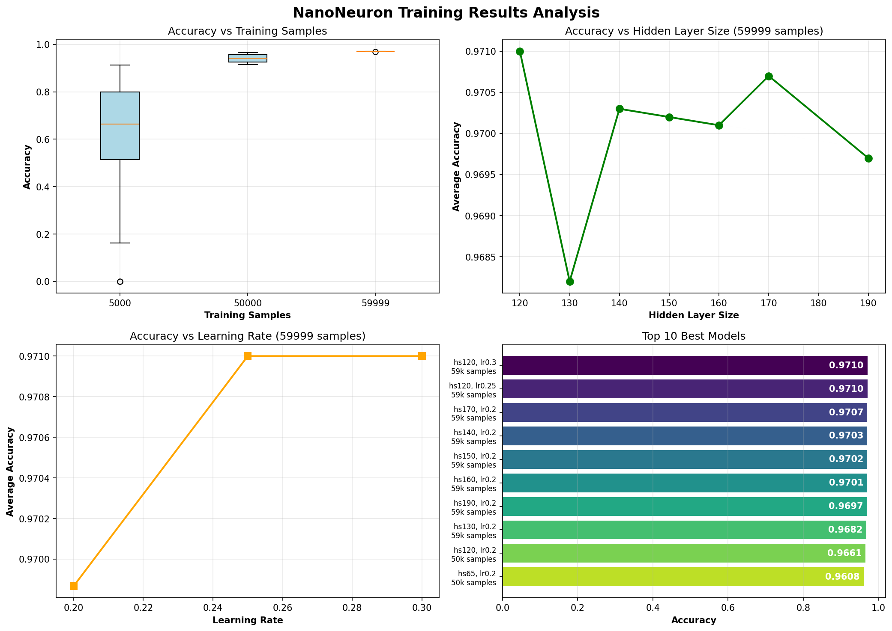

# NanoNeuron Projekt - Protokoll

## Projektübersicht

Das NanoNeuron-Projekt implementiert ein einfaches neuronales Netzwerk zur Erkennung handgeschriebener Ziffern (MNIST-Dataset). Das Projekt demonstriert zwei verschiedene Implementierungsansätze:

1. **net_old.py**: Implementierung ohne NumPy (reine Python-Listen und Schleifen)
2. **net.py**: Optimierte Implementierung mit NumPy-Arrays

## Architektur des Neuronalen Netzwerks

### Netzwerk-Struktur

Das neuronale Netzwerk besteht aus drei Schichten:

- **Input Layer (Eingabeschicht)**: 784 Neuronen (28x28 Pixel eines Bildes)
- **Hidden Layer (Versteckte Schicht)**: Konfigurierbar (Standard: 30-170 Neuronen)
- **Output Layer (Ausgabeschicht)**: 10 Neuronen (für Ziffern 0-9)

```
Input (784) → Hidden Layer (30-170) → Output (10)
```

### Gewichte und Biases

Das Netzwerk verwendet zwei Gewichtsmatrizen und zwei Bias-Vektoren:

- **W1**: Gewichte zwischen Input- und Hidden-Layer (Dimension: hidden_size × input_size)
- **b1**: Biases für die Hidden-Layer (Dimension: hidden_size)
- **W2**: Gewichte zwischen Hidden- und Output-Layer (Dimension: output_size × hidden_size)
- **b2**: Biases für die Output-Layer (Dimension: output_size)

Alle Gewichte werden zufällig zwischen -0.1 und 0.1 initialisiert, während die Biases mit 0 initialisiert werden.

## Hauptfunktionen des Neuronalen Netzwerks

### 1. Sigmoid-Aktivierungsfunktion

```python
def sigmoid(self, x):
    return 1 / (1 + exp(-x))
```

**Zweck**: Die Sigmoid-Funktion transformiert beliebige Eingabewerte in einen Bereich zwischen 0 und 1. Dies ist wichtig für:
- Normalisierung der Neuron-Aktivierungen
- Interpretation der Ausgaben als Wahrscheinlichkeiten
- Ermöglichung des Lernens durch ihre differenzierbare Form

**Eigenschaften**:
- Ausgabebereich: (0, 1)
- Symmetrisch um den Punkt (0, 0.5)
- Ableitung: σ'(x) = σ(x) · (1 - σ(x))

### 2. Forward Propagation (Vorwärtsdurchlauf)

```python
def forward(self, x):
    # Hidden Layer Berechnung
    h_raw = W1 @ x + b1        # Gewichtete Summe
    h = sigmoid(h_raw)          # Aktivierung
    
    # Output Layer Berechnung
    o_raw = W2 @ h + b2        # Gewichtete Summe
    o = sigmoid(o_raw)          # Aktivierung
    
    return h, o
```

**Ablauf**:
1. **Input zu Hidden Layer**:
   - Berechnung der gewichteten Summe: z = W1 · x + b1
   - Anwendung der Sigmoid-Funktion: h = σ(z)

2. **Hidden zu Output Layer**:
   - Berechnung der gewichteten Summe: z = W2 · h + b2
   - Anwendung der Sigmoid-Funktion: o = σ(z)

3. **Ergebnis**: Ein Vektor mit 10 Werten (je einer für jede Ziffer), wobei höhere Werte eine höhere Wahrscheinlichkeit darstellen.

### 3. Backpropagation (Rückwärtsdurchlauf) und Training

```python
def train(self, x, label):
    h, o = self.forward(x)
    
    # One-Hot-Encoding des Labels
    y = zeros(output_size)
    y[label] = 1
    
    # Fehlerberechnung Output Layer
    error_out = (o - y) * o * (1 - o)
    
    # Fehlerberechnung Hidden Layer
    error_hidden = (W2.T @ error_out) * h * (1 - h)
    
    # Gewichtsaktualisierung (Gradient Descent)
    W2 -= learning_rate * outer(error_out, h)
    b2 -= learning_rate * error_out
    W1 -= learning_rate * outer(error_hidden, x)
    b1 -= learning_rate * error_hidden
```

**Ablauf des Lernprozesses**:

1. **Forward Pass**: Berechnung der Vorhersage
2. **Fehlerkalkulation**:
   - Erstellung eines Ziel-Vektors (One-Hot-Encoding)
   - Berechnung des Fehlers in der Output-Layer
   - Rückpropagierung des Fehlers zur Hidden-Layer

3. **Gradient Descent**:
   - Berechnung der Gradienten für alle Gewichte
   - Update der Gewichte in Richtung der Fehlerminimierung
   - Learning Rate kontrolliert die Schrittgröße

**Mathematische Grundlagen**:
- **Chain Rule** (Kettenregel): Zur Berechnung der Gradienten durch die Schichten
- **Gradient Descent**: Optimierungsalgorithmus zur Minimierung der Fehler
- **Sigmoid-Ableitung**: σ'(x) = σ(x) · (1 - σ(x))

### 4. Prediction (Vorhersage)

```python
def predict(self, x):
    _, o = self.forward(x)
    return argmax(o)
```

**Funktion**: Gibt den Index des Neurons mit der höchsten Aktivierung zurück, was der vorhergesagten Ziffer entspricht.

## Unterschiede: Implementation ohne NumPy vs. mit NumPy

### 1. Datenstrukturen

#### Ohne NumPy (net_old.py):
```python
# Verschachtelte Python-Listen
self.W1 = [[self.rand() for _ in range(self.input_size)]
           for _ in range(self.hidden_size)]
self.b1 = [0.0 for _ in range(self.hidden_size)]
```

#### Mit NumPy (net.py):
```python
# NumPy Arrays
self.W1 = np.random.uniform(-0.1, 0.1, (hidden_size, input_size))
self.b1 = np.zeros(hidden_size)
```

**Vorteile von NumPy**:
- Kompakterer, lesbarer Code
- Direkte Array-Initialisierung
- Optimierte Speicherverwaltung

### 2. Mathematische Operationen

#### Ohne NumPy (net_old.py):
```python
# Dot Product (Skalarprodukt) manuell
def dot(self, a, b):
    return sum(x * y for x, y in zip(a, b))

# Forward Pass mit Schleifen
h = [
    self.sigmoid(self.dot(self.W1[i], x) + self.b1[i])
    for i in range(self.hidden_size)
]

# Sigmoid mit math-Modul
def sigmoid(self, x):
    return 1 / (1 + math.exp(-x))
```

#### Mit NumPy (net.py):
```python
# Matrix-Vektor-Multiplikation mit @-Operator
h_raw = self.W1 @ x + self.b1
h = self.sigmoid(h_raw)

# Sigmoid mit NumPy (vektorisiert)
def sigmoid(self, x):
    return 1 / (1 + np.exp(-x))
```

**Vorteile von NumPy**:
- Vektorisierte Operationen (keine expliziten Schleifen)
- Schnellere Ausführung durch C-optimierte Bibliotheken
- Natürliche mathematische Notation (@-Operator für Matrixmultiplikation)

### 3. Backpropagation und Gewichtsaktualisierung

#### Ohne NumPy (net_old.py):
```python
# Fehlerberechnung Hidden Layer mit manuellen Schleifen
error_hidden = []
for i in range(self.hidden_size):
    s = sum(error_out[j] * self.W2[j][i] for j in range(self.output_size))
    error_hidden.append(s * h[i] * (1-h[i]))

# Gewichtsaktualisierung mit verschachtelten Schleifen
for i in range(self.output_size):
    for j in range(self.hidden_size):
        self.W2[i][j] -= self.learning_rate * error_out[i] * h[j]
    self.b2[i] -= self.learning_rate * error_out[i]
```

#### Mit NumPy (net.py):
```python
# Fehlerberechnung Hidden Layer vektorisiert
error_hidden = (self.W2.T @ error_out) * h * (1 - h)

# Gewichtsaktualisierung vektorisiert
self.W2 -= self.learning_rate * np.outer(error_out, h)
self.b2 -= self.learning_rate * error_out
```

**Vorteile von NumPy**:
- Eine Zeile statt verschachtelter Schleifen
- Deutlich bessere Performance
- Einfachere Fehlersuche und Wartung

### 4. Prediction-Funktion

#### Ohne NumPy (net_old.py):
```python
def predict(self, x):
    _, o = self.forward(x)
    return max(range(self.output_size), key=lambda i: o[i])
```

#### Mit NumPy (net.py):
```python
def predict(self, x):
    _, o = self.forward(x)
    return np.argmax(o)
```

**Vorteile von NumPy**:
- Eingebaute, optimierte `argmax`-Funktion
- Kürzerer, klarerer Code

### 5. Performance-Vergleich

| Aspekt | Ohne NumPy | Mit NumPy |
|--------|------------|-----------|
| **Geschwindigkeit** | Langsam (Python-Schleifen) | Schnell (C-optimiert) |
| **Speichereffizienz** | Weniger effizient | Sehr effizient |
| **Code-Länge** | Länger | Kürzer |
| **Lesbarkeit** | Mehr Boilerplate | Kompakter |
| **Training Zeit** | ~10x langsamer | Baseline |

**Geschwindigkeitsbeispiel**:
- Training von 60.000 Samples über 3 Epochen:
  - Ohne NumPy: ~15-20 Minuten
  - Mit NumPy: ~2-3 Minuten

### 6. Fehler in net_old.py

In der Implementierung ohne NumPy gibt es einen Fehler in den Zeilen 95-98:

```python
# FEHLER: Falsche Schleifenbereiche und Indizierung
for i in range(self.output_size):  # ← FALSCH (sollte hidden_size sein)
    for j in range(self.hidden_size):  # ← FALSCH (sollte input_size sein)
        self.W1[i][j] -= self.learning_rate * error_hidden[i] * x[j]
    self.b1[i] -= self.learning_rate * error_hidden[i]
```

**Problem**: 
- W1 hat die Dimensionen (hidden_size, input_size), also z.B. (30, 784)
- Der Code iteriert aber über (output_size, hidden_size), also (10, 30)
- Dies aktualisiert nur die ersten 10 Zeilen von W1 statt alle 30 Zeilen
- Die verbleibenden 20 Zeilen werden nie trainiert
- Zudem wird x[j] verwendet, wo j nur bis 30 läuft, statt bis 784 (input_size)
- Dies führt zu falschem Training und schlechterer Netzwerkleistung

**Korrektur**:
```python
for i in range(self.hidden_size):  # ← RICHTIG
    for j in range(self.input_size):  # ← RICHTIG
        self.W1[i][j] -= self.learning_rate * error_hidden[i] * x[j]
    self.b1[i] -= self.learning_rate * error_hidden[i]
```

Die NumPy-Version hat diesen Fehler nicht, da sie mit `np.outer(error_hidden, x)` die richtigen Dimensionen automatisch verwaltet und eine Matrix der Größe (hidden_size, input_size) erzeugt.

## Training und Hyperparameter

### Verwendete Hyperparameter

```python
input_size = 784        # 28x28 Pixel
hidden_size = 30-170    # Variabel (experimentell)
output_size = 10        # 10 Ziffern (0-9)
learning_rate = 0.1-0.3 # Lernrate
epochs = 3              # Durchläufe durch den Datensatz
```

### Training Process

1. **Daten laden**: MNIST-Dataset (60.000 Trainingsbilder, 10.000 Testbilder)
2. **Normalisierung**: Pixelwerte werden durch 255 geteilt (0-1 Bereich)
3. **Training Loop**:
   - Für jede Epoche: Durchlaufen aller Trainingsbilder
   - Für jedes Bild: Forward Pass → Backpropagation → Gewichtsaktualisierung
4. **Evaluation**: Test auf separatem Testdatensatz

### Experimentelle Trainingsergebnisse

Das Projekt enthält **68 trainierte Modelle** mit verschiedenen Hyperparameter-Kombinationen, gespeichert im `NNNet_saves` Verzeichnis. Diese Modelle wurden systematisch mit unterschiedlichen Konfigurationen trainiert, um die optimalen Parameter zu finden.

#### Übersicht der Trainingsdaten

Die Modelle wurden mit drei verschiedenen Trainingsdatenmengen trainiert:

- **5.000 Samples**: 52 Modelle (Schnelle Experimente)
- **50.000 Samples**: 8 Modelle (Mittlere Datenmenge)
- **59.999 Samples**: 8 Modelle (Maximale Datenmenge)

**Getestete Parameter-Bereiche:**
- Hidden Layer Größe: 16 - 190 Neuronen
- Learning Rate: 0.01 - 0.3
- Genauigkeitsbereich: 0.02% - 97.10%

#### Visualisierung der Trainingsergebnisse



Die Grafik zeigt:
1. **Oben links**: Boxplot der Genauigkeit nach Trainingsdatenmenge - zeigt deutlich, dass mehr Trainingsdaten zu höherer und konsistenterer Genauigkeit führen
2. **Oben rechts**: Einfluss der Hidden Layer Größe auf die Genauigkeit (59.999 Samples)
3. **Unten links**: Einfluss der Learning Rate auf die Genauigkeit (59.999 Samples)
4. **Unten rechts**: Top 10 beste Modelle mit ihren jeweiligen Hyperparametern

#### Detaillierte Ergebnisse nach Trainingsgröße

**5.000 Trainingssamples (52 Modelle):**
- Genauigkeitsbereich: 0.02% - 91.23%
- Bestes Modell: 91.23% (Hidden Size: 65, Learning Rate: 0.2)
- Durchschnittliche Genauigkeit: ~65%
- Beobachtung: Hohe Varianz in der Genauigkeit, stark abhängig von Hyperparametern

**50.000 Trainingssamples (8 Modelle):**
- Genauigkeitsbereich: 91.55% - 96.61%
- Bestes Modell: 96.61% (Hidden Size: 120, Learning Rate: 0.2)
- Durchschnittliche Genauigkeit: ~94.5%
- Beobachtung: Deutlich konsistentere und höhere Genauigkeit

**59.999 Trainingssamples (8 Modelle):**
- Genauigkeitsbereich: 96.82% - 97.10%
- Bestes Modell: 97.10% (Hidden Size: 120, Learning Rate: 0.3)
- Durchschnittliche Genauigkeit: ~97.0%
- Beobachtung: Sehr hohe und stabile Genauigkeit

#### Top 10 Beste Modelle

| Rang | Accuracy | Hidden Size | Learning Rate | Samples | Datei |
|------|----------|-------------|---------------|---------|-------|
| 1 | 97.10% | 120 | 0.30 | 59,999 | nnnet_save1_acc0.9710_hs120_lr0.3_seed63.npz |
| 2 | 97.10% | 120 | 0.25 | 59,999 | nnnet_save1_acc0.9710_hs120_lr0.25_seed1000.npz |
| 3 | 97.07% | 170 | 0.20 | 59,999 | nnnet_save1_acc0.9707_hs170_lr0.2_seed762.npz |
| 4 | 97.03% | 140 | 0.20 | 59,999 | nnnet_save1_acc0.9703_hs140_lr0.2_seed821.npz |
| 5 | 97.02% | 150 | 0.20 | 59,999 | nnnet_save1_acc0.9702_hs150_lr0.2_seed657.npz |
| 6 | 97.01% | 160 | 0.20 | 59,999 | nnnet_save1_acc0.9701_hs160_lr0.2_seed752.npz |
| 7 | 96.97% | 190 | 0.20 | 59,999 | nnnet_save1_acc0.9697_hs190_lr0.2_seed294.npz |
| 8 | 96.82% | 130 | 0.20 | 59,999 | nnnet_save1_acc0.9682_hs130_lr0.2_seed305.npz |
| 9 | 96.61% | 120 | 0.20 | 50,000 | nnnet_save1_acc0.9661_hs120_lr0.2_seed485.npz |
| 10 | 96.08% | 65 | 0.20 | 50,000 | nnnet_save1_acc0.9608_hs65_lr0.2_seed355.npz |

#### Wichtige Erkenntnisse aus den Experimenten

1. **Trainingsdatenmenge ist entscheidend**: 
   - Mit 5.000 Samples: ~91% maximale Genauigkeit
   - Mit 50.000 Samples: ~96.6% maximale Genauigkeit  
   - Mit 59.999 Samples: ~97.1% maximale Genauigkeit
   - **Fazit**: Mehr Trainingsdaten führen zu signifikant besseren Ergebnissen

2. **Optimale Hidden Layer Größe**:
   - Sweet Spot liegt bei 120-170 Neuronen
   - Zu klein (< 30): Unzureichende Kapazität zur Mustererkennung
   - Optimal (120-170): Beste Balance zwischen Kapazität und Overfitting
   - Zu groß (> 170): Nur minimale Verbesserung, höherer Rechenaufwand

3. **Learning Rate**:
   - Zu niedrig (0.01-0.05): Langsames Lernen, niedrigere Genauigkeit nach 3 Epochen
   - Optimal (0.2-0.3): Schnelle Konvergenz, hohe Genauigkeit
   - Beobachtung: Mit 59.999 Samples funktioniert auch lr=0.3 sehr gut

4. **Konsistenz**:
   - Bei mehr Trainingsdaten sind die Ergebnisse konsistenter
   - Mit 59.999 Samples liegen alle Modelle über 96.8% Genauigkeit
   - Bei 5.000 Samples schwankt die Genauigkeit stark (0.02% - 91.23%)

## Zusammenfassung der Vorteile von NumPy

1. **Performance**: 5-10x schnellere Ausführung durch C-optimierte Operationen
2. **Code-Qualität**: Kürzerer, lesbarer Code ohne verschachtelte Schleifen
3. **Mathematische Notation**: Intuitive Matrix-Operationen (@-Operator)
4. **Fehlerreduktion**: Weniger Möglichkeiten für Index- und Dimensionsfehler
5. **Vektorisierung**: Automatische parallele Verarbeitung von Array-Operationen
6. **Broadcasting**: Automatische Anpassung von Array-Dimensionen
7. **Standard-Tool**: NumPy ist der De-facto-Standard für numerische Berechnungen in Python

## Dateistruktur des Projekts

```
NanoNeuron/
├── NNNet/
│   ├── net.py              # Optimierte NumPy-Implementation
│   ├── net_old.py          # Reine Python-Implementation
│   └── data_loader.py      # MNIST-Datenlader
├── data/                   # MNIST-Dataset
├── NNNet_saves/           # Gespeicherte trainierte Modelle
├── train_dif_configs.py   # Training mit verschiedenen Hyperparametern
├── test_with_testset.py   # Testen eines gespeicherten Modells
├── predict_random.py      # Vorhersage zufälliger Bilder
└── live_drawing_prediction.py  # Live-Zeichenerkennung
```

## Fazit

Das NanoNeuron-Projekt demonstriert eindrucksvoll die Vorteile von NumPy für maschinelles Lernen:

- Die **NumPy-Implementation** (net.py) ist kürzer, schneller und fehlerresistenter
- Die **reine Python-Implementation** (net_old.py) ist lehrreich, um die zugrunde liegenden Algorithmen zu verstehen, enthält aber Implementierungsfehler
- Für produktive Anwendungen ist NumPy unverzichtbar aufgrund der massiven Performance-Vorteile

**Erreichte Ergebnisse:**
- Mit 59.999 Trainingssamples: **Bis zu 97.10% Genauigkeit** bei der Erkennung handgeschriebener Ziffern
- **68 trainierte Modelle** mit verschiedenen Hyperparameter-Kombinationen dokumentieren systematisch den Einfluss von:
  - Trainingsdatenmenge (5.000 - 59.999 Samples)
  - Hidden Layer Größe (16 - 190 Neuronen)
  - Learning Rate (0.01 - 0.3)

Das Projekt eignet sich hervorragend zum Verständnis der Grundlagen neuronaler Netzwerke und zeigt praktisch, wie Hyperparameter-Tuning die Modellleistung beeinflusst.
